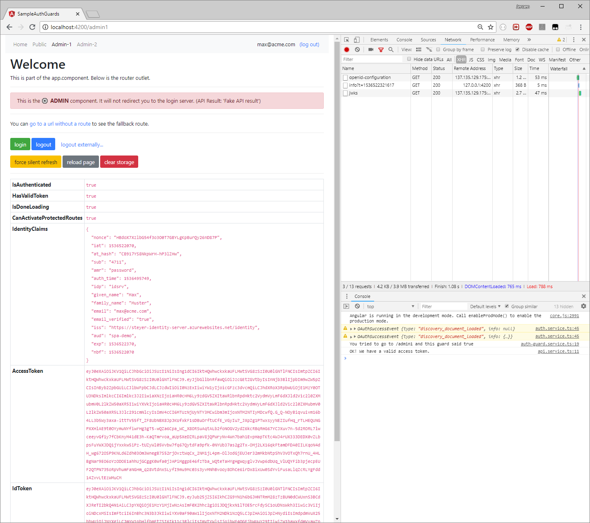

# Example angular-oauth2-oidc with AuthGuard

This repository shows a basic Angular CLI application with [the `angular-oauth2-oidc` library](https://github.com/manfredsteyer/angular-oauth2-oidc) and Angular AuthGuards.
This was borrowed and modified from [this repo](https://github.com/jeroenheijmans/sample-angular-oauth2-oidc-with-auth-guards).

## Features

⚠ To see **the Implicit Flow** refer to [the `implicit-flow` branch](https://github.com/jeroenheijmans/sample-angular-oauth2-oidc-with-auth-guards/tree/implicit-flow) (which might be getting outdated, since Code Flow is now the recommended flow).

This demonstrates:

- Use of **the Code+PKCE Flow** (so no JWKS validation)
- Modules (core, shared, and two feature modules)
- An auth guard that forces you to login when navigating to protected routes
- An auth guard that just prevents you from navigating to protected routes
- Asynchronous loading of login information (and thus async auth guards)
- Using `localStorage` for storing tokens (use at your own risk!)
- Loading IDS details from its discovery document
- Trying refresh on app startup before potientially starting a login flow
- OpenID's external logout features

Most interesting features can be found in [the core module](./src/app/core).

## Usage

This repository has been scaffolded with the Angular 5 CLI, then later upgraded to newer versions of the Angular CLI.
To use the repository:

1. Clone this repository
1. Run `npm install` to get the dependencies
1. Run `nd serve --ssl` to get it running on [https://localhost:4200](https://localhost:4200)

You can connect to your own IdentityServer by changing `auth-config.ts`.
Note that your server must whitelist both `http://localhost:4200/index.html` and `http://localhost:4200/silent-refresh.html` for this to work.

## Example

The application is supposed to look somewhat like this:

